How to
======

…configure c.geo
----------------

After installing collective.geo on your Plone site you should configure it using its control panel.
Go to the Plone control panel and click on Collective geo link.

In the collective geo settings form you can:

* choose which content types can be georeferenced;
* choose which map layers you need, for instance Open Street Map, Google Maps, Bing maps;
* set the default center of the map to be used when no other coordinates are provided;
* select the default styles of the geographical shapes on the map;
* choose the position where the map will appears when you display a georeferenced content type;
* use the "advanced tab" to setup new viewletmanagers.

Take a look to these screenshots:

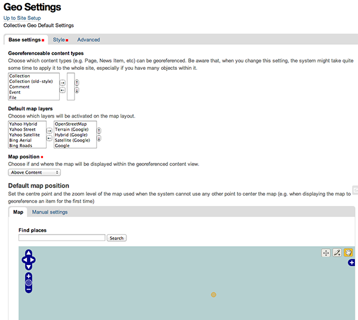

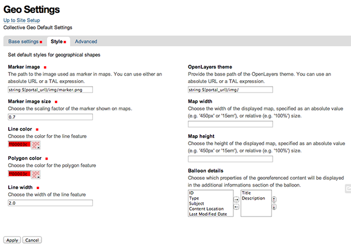

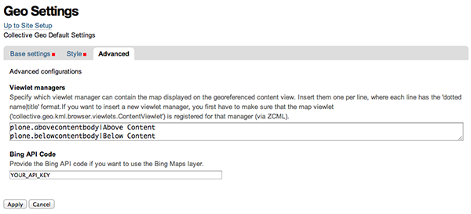

…georeference a content type
---------------------------

After configuring collective geo you can georeference a content type by adding a new content type and click on Coordinates tab.

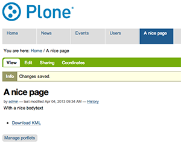

The Coordinates link will appear on the edit bar on content types that you've choosen as geo referenceable on collective geo settings form.

In the form that will load you can use the toolbar on the map to add a geographical shape like: a point, a line or a polygon.

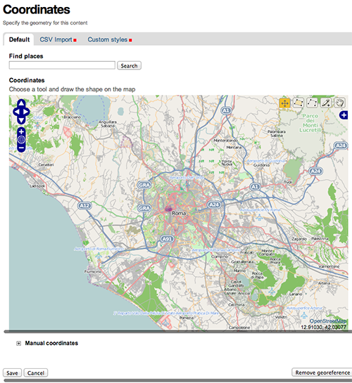

(polygon example)

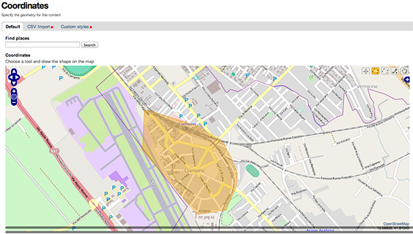

You can also use the text input on top of the map to search for a specific location and its coordinates.

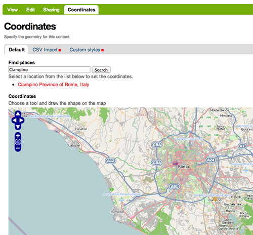

At the bottom of the map you'll find a textarea where you can manually put the coordinate in WKT format.

On the second tab of this form you can also override the default map styles for this content type.

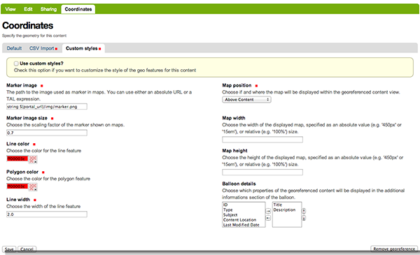

After saving the form, the map will be displayed in the position you've chosen in the coordinates form or in the default position.

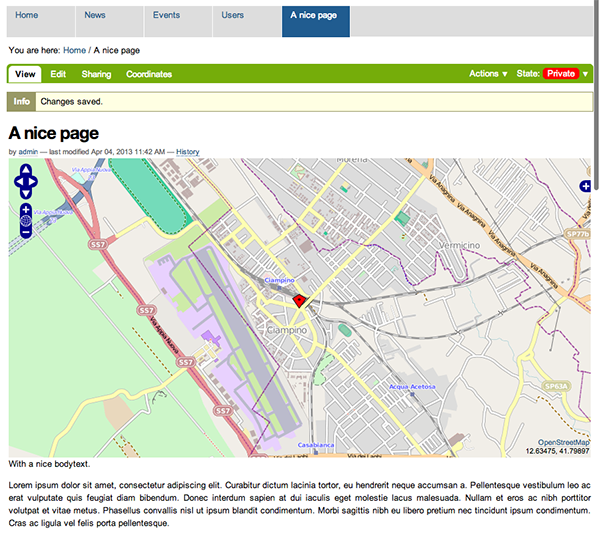

To remove the coordinates from a content type just click on the Coordinates tab and then click on the button Remove coordinates

…aggregate locations in a map
-----------------------------

When you have georeferenced some contents, you can aggregate these contents on a single map. To do it you have to create a content type Collection in order to select the content types you want to aggregate.

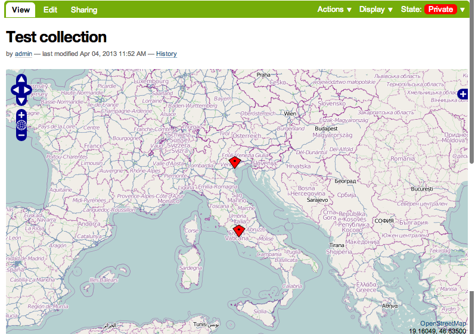

After saving them you have to choose the item KML Openlayers view from the Display menu.

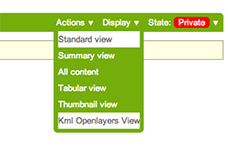

…override a map layer template
------------------------------

All the maps in collective geo are composed by one or more map layers and each layer returns a javascript snippet by a page template which contains all informazion about the layer itself.

These page template are stored in Zope and can be customized by the portal view customization tool on the ZMI.

For example, the layer that defines the Google map layer is defined by this snippet::

    function(){
        return new OpenLayers.Layer.Google(
            '%(title)s',
            {
              'sphericalMercator':true,numZoomLevels:20
            }
        );
    }

Into this javascript function you can use the OpenLayers API to create the layer correctly.

You can use the %(title)s variable to include the layer's title.

…override KML file
------------------

Collective geo mainly uses a KML file and a Vector OpenLayers layer to display the maps.

This's useful for dividing javascript machinery that renders the map from geographical data stored in Zope.

This way we can change the data in KML file without having to modify the javascript or the map layers.

The KML file is defined by a Browser view class and a page template. This page template uses some macros to render many parts of it.

To override the default behaviour you can choose to override entirely the main KML template or only the macro template.

You can find all templates on portal view customization tool on the ZMI.
