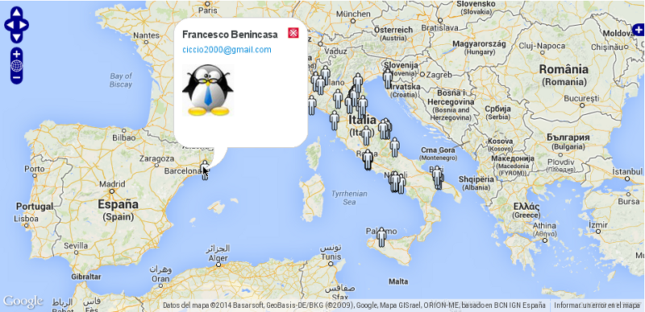
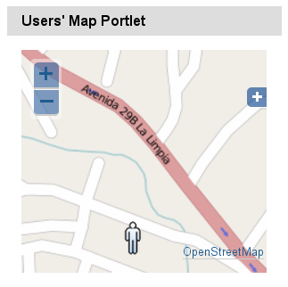

collective.geo.usersmap
-----------------------

This package provides a map showing the registered users of the portal by the location attributes of each user.

Dependencies
============

* Plone >= 4.2
* collective.geo.mapwidget > 2.0

Installation
============

This addon can be installed has any other addons, please follow official
documentation_.

.. _documentation: http://plone.org/documentation/kb/installing-add-ons-quick-how-to

Add to buildouts configuration

::

    [buildout]
    ...
    eggs =
        collective.geo.usersmap

Re-run buildout, e.g. with

::

    $ ./bin/buildout

Restart Plone and activate the product in Plones Add-on configuration
section.

How it works
============

The "location" attribute in the user's profile is automatically transformed in its corresponding coordinates, and then registered in a specific utility.

The Plone registry contains keys to manage the title and description showing on the map, and the list of user's attributes to show in the map in the specified order.

How to use the map
==================

This package provides both a browser view at http://localhost:8080/Plone/@@usersmap_view.

Also this package provides a portlet named **usersmap portlet**.

Utils
=====

A browser view at http://localhost:8080/Plone/@@usersmap_reindex is provided to let the admin reindex all the users' locations in case of any misalignment.

Optionally, you can define a crontab job to eventually run the update of users index.

Known bugs
==========

You can set just one **usersmap portlet** per page.

Resources
=========

- Code repository: https://github.com/collective/collective.geo.usersmap/
- Questions and comments to http://www.coactivate.org/projects/collectivegeo/lists/collectivegeo-discussion/
- Report bugs at https://github.com/collective/ccollective.geo.usersmap/issues
